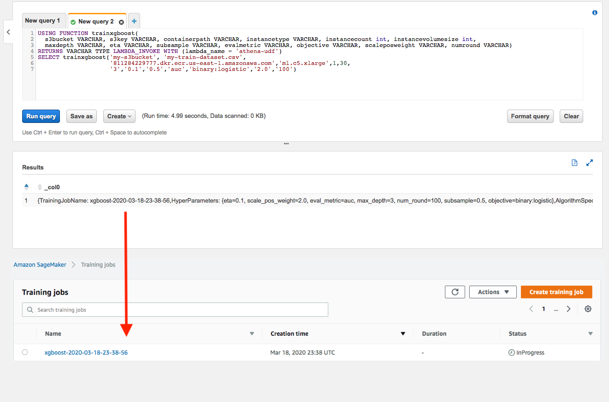

# Amazon Athena Query Federation with Amazon SageMaker

This repo is created to demonstrate how to integrate Athena User Defined Function (UDF) with Amazon SageMaker 

The Amazon Athena Query Federation SDK allows you to customize Amazon Athena with your own code. This enables you to integrate with new data sources, proprietary data formats, or build in new user defined functions. Initially these customizations will be limited to the parts of a query that occur during a TableScan operation but will eventually be expanded to include other parts of the query lifecycle using the same easy to understand interface.

This functionality is currently in **Public Preview** while customers provide us feedback on usability, ease of using the service or building new connectors. We do not recommend that you use these connectors in production or use this preview to make assumptions about the performance of Athena’s Federation features. As we receive more feedback, we will make improvements to the preview and increase limits associated with query/connector performance, APIs, SDKs, and user experience. The best way to understand the performance of Athena Data Source Connectors is to run a benchmark when they become generally available (GA) or review our performance guidance.

**To enable this Preview feature you need to create an Athena workgroup named AmazonAthenaPreviewFunctionality and run any queries attempting to federate to this connector, use a UDF, or SageMaker inference from that workgroup.**

tldr; Pre-reqs to Get Started:
1. Ensure you have the [proper permissions/policies to deploy/use Athena Federated Queries](https://docs.aws.amazon.com/athena/latest/ug/federated-query-iam-access.html)
1. Ensure latest version of [SAM CLI is intalled](https://docs.aws.amazon.com/serverless-application-model/latest/developerguide/serverless-sam-cli-install.html) (Tested with 0.45.0)
1. Ensure [SageMaker Java SDK](https://github.com/aws/aws-sdk-java/tree/master/aws-java-sdk-sagemaker) is installed on the machine 
1. Ensure Amazon SageMaker Java SDK is added in Maven Local repo. If not, add `<packaging>jar</packaging>` in SageMaker SDK pom.xml, then compile with Maven command `mvn clean install`.
1. Navigate to [Servless Application Repository](https://console.aws.amazon.com/serverlessrepo/home#/available-applications) and search for "athena-federation". Be sure to check the box to show entries that require custom IAM roles. 
1. Look for entries published by the "Amazon Athena Federation" author.
1. Deploy the application
1. Go to the [Athena Console in us-east-1 (N. Virginia)](https://console.aws.amazon.com/athena/home) and create a workgroup called "AmazonAthenaPreviewFunctionality", any queries run from that workgroup will be able to use Preview features described in this repository.
1. Run a query "show databases in \`lambda:<func_name>\`" where <func_name> is the name of the Lambda function you deployed in the previous steps.
1. Go to ["athena-udfs"](./athena-udfs) folder on this repo and follow instruction there to create custom Athena UDF with Amazon SageMaker

For more information please consult:

 1. [Intro Video](https://www.youtube.com/watch?v=tZia_5qxPkY&feature=youtu.be)
 1. [SDK ReadMe](https://github.com/awslabs/aws-athena-query-federation/blob/master/athena-federation-sdk/README.md)
 1. [Quick Start Guide](https://github.com/awslabs/aws-athena-query-federation/tree/master/athena-example)
 1. [Available Connectors](https://github.com/awslabs/aws-athena-query-federation/wiki/Available-Connectors)
 1. [Federation Features](https://github.com/awslabs/aws-athena-query-federation/wiki/Features)
 1. [How To Build A Connector or UDF](https://github.com/awslabs/aws-athena-query-federation/wiki/How_To_Build_A_Connector_or_UDF)
 1. [Gathering diagnostic info for support](https://github.com/awslabs/aws-athena-query-federation/wiki/Gather_Diagnostic_Info)
 1. [Frequently Asked Questions](https://github.com/awslabs/aws-athena-query-federation/wiki/FAQ)
 1. [Common Problems](https://github.com/awslabs/aws-athena-query-federation/wiki/Common_Problems)
 1. [Installation Pre-requisites](https://github.com/awslabs/aws-athena-query-federation/wiki/Installation_Prerequisites)
 1. [Known Limitations & Open Issues](https://github.com/awslabs/aws-athena-query-federation/wiki/Limitations_And_Issues)
 1. [Predicate Pushdown How-To](https://github.com/awslabs/aws-athena-query-federation/wiki/Predicate-Pushdown-How-To)
 1. [Our Github Wiki](https://github.com/awslabs/aws-athena-query-federation/wiki).
 1. [Java Doc](https://awslabs.github.io/aws-athena-query-federation/)

## License

This project is licensed under the Apache-2.0 License.
